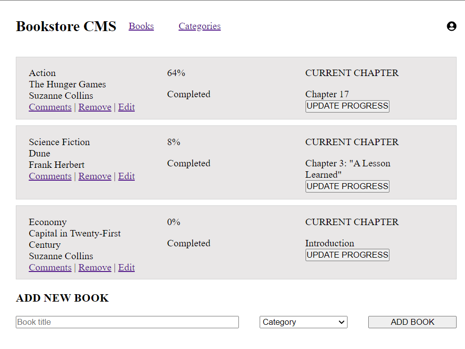

## Bookstore app
This project will lay foundations for your Bookstore website. You will create a React and Redux app. You will structure your files using the "feature folder" approach. You will also set up routing using React Router.

# Screenshot

## Built With
- JavaScript/React
- React Router
- JSX
- CSS
  

## Link to the live page

> Feel free to check the https://app-tests-heroku.herokuapp.com/

Feel free to check the https://app-tests--voluble-alfajores-60db6f.netlify.app/

## Install Dependancies

run : `npm install`

### Build the app

run: `npm run build`

### Run the app

run: `npm start`

## Authors

👤 **Silvia Tofana **

- GitHub: [@silviatofana](https://github.com/silviatofana)
- LinkedIn: [@silviatofana](www.linkedin.com/in/silvia-tofana-10b852186)
- Twitter: [@silviatofana](https://twitter.com/SilviaTofana)

## Collaborators

## 🤝 Contributing

Contributions, issues, and feature requests are welcome!

## Getting Started

To get a local copy follow these simple steps:

- Copy this link .

- Create a local directory that you want to clone the repository.

- Open the command prompt in the created directory.

- On the terminal run this command git clone

- Go to the repository folder using command prompt cd math-magician.

- Install the dev dependencies for linters run npm install.

## Acknowledgments

- Hat tip to anyone whose code was used
- Inspiration
- Microverse
React and React Router documentation
Stack Overflow

